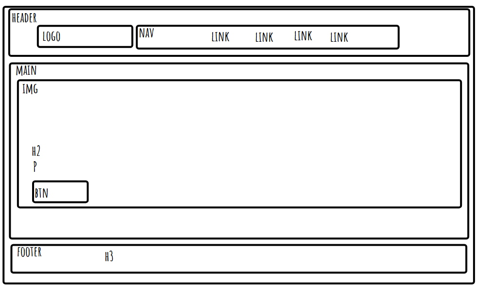

# week 1 assignment

## Reflection

- basic requirements

  - I believe that i achieved all necessary goals in the basic necessities.
  - I found it hard to try and crop the images to fit the window correctly.
    

- stretch goals

  - i added the back to top
  - i added hover for the navbar
  - i added social media links

- i found the hover a bit hard to do and i was surprised how ease it was to do back to top.

## References

- i use okgo.app to help make a layout
- all my images are from google
- i used w3schools to find a way to make the button got to a link
